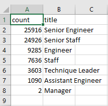

# Pewlett-Hackard-Analysis

## Overview
This analysis was done for Pewlett Hackard due to the impending retirement of several employees and the need to plan for future vacancies. Specifically, the analysis aimed to answer two questions: 
1) Which employees are eligible for retirement? 
2) Which positions will need to be filled in the near future?

This information would help the company prepare new coworkers for these upcoming vacancies.

To obtain the required data, the analysis focused on identifying the number of employees and their job positions that will be leaving the company in the coming years. To achieve this, the existing company database was utilized to create tables and present the required information. CSV files were exported from the company to build a new database using SQL.

## Results
* Senior engineers have the greatest number of retiring individuals (25,916).
* There are only 2 managers retiring.
* Senior staffs make up many employees who can participate in the mentorship program.
* Most of the staff retiring and eligible to participate in the mentorship program are engineers.

 

## Summary
The analysis has revealed that approximately 50,000 positions at the company will need to be filled in the near future. However, there are not enough retirement-ready employees available to mentor the next generation of workers, creating a discrepancy that the company must address.

To prevent a shortage of mentors, I would propose adding two new tables to the existing database.

Software:
* SQL
* PostgreSQL
* pgAdmin
